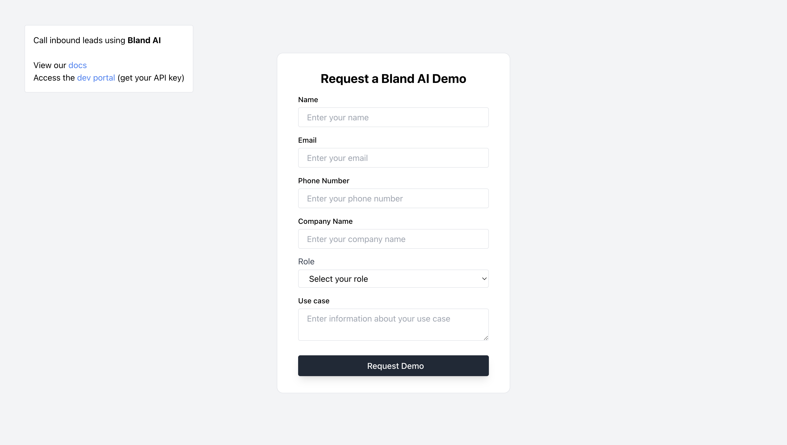

# Bland AI Inbound Lead Cookbook

Welcome welcome! We built this cookbook to show off how to qualify an inbound lead within _five minutes_ of them submitting a form on your website.

For context: it turns out if you call someone within five minutes, you have an 80% higher chance of closing them. Even though you can't wait by the phone all day, your AI phone agent can.

We programmed this Bland AI phone agent to call inbound leads, qualify them, then transfer them to an account executive. If you want though, you can update the prompting to qualify the lead, then hang up the call. And then you could immediatley send a text message scheduling link.

Learn more about [Bland AI](https://www.bland.ai).

Sign up for a [developer account](https://app.bland.ai).

Join the [discord community](https://discord.gg/QvxDz8zcKe).



## Last bits of context

The most important file is `server.js`. Go there to see the prompt for the AI phone agent. Everything else enables the visual interface (the form) so that you can interact with our API.

# Frontend setup

Open your terminal and type `npm install` to install all your dependencies.

Then run `npm start`. The react application will load up and display in your browser.

# Backend setup

Open your terminal and navigate to your backend by typing `cd backend`.

Once again run 'npm install` to install your dependencies.

Next, to run your server, type `node server.js` into your terminal. Your server should start running on port 4000.

## Getting Your API key

At this point you've hooked everything up! But you've still go some work left.

Within your backend folder, create a `.env` file. Within that file, insert the following:

```
BLAND_API_KEY=sk-xxxxxxxxxxxxxxxxxx
```

To get your own API key, go to the [developer portal](https://app.bland.ai) and sign up. Once you have your API key, update the value in your `.env` file.

## Updating the `transfer phone number`

Open your `server.js` file and update the `TRANSFER_PHONE_NUMBER`. If you don't have a second phone on hand, try using your own number.

That way, when the AI phone agent triggers the call transfer, it'll be obvious.

# Final steps

Restart your node server.

Open the web application, fill out the form, and hit submit.

You should receive a phone call.

# How to get support

If you have any issues whatsoever, join the [discord community](https://discord.gg/QvxDz8zcKe) and post a bug report. Our team is incredibly responsive and will help you as soon as possible.

# More info about Bland AI

We've built an API for sending and receiving phone calls with an AI voice agent. Check out our [discord community](https://discord.gg/QvxDz8zcKe). And read our [docs](https://docs.bland.ai/introduction) to see all the other crazy powerful applications you can build on Bland!
